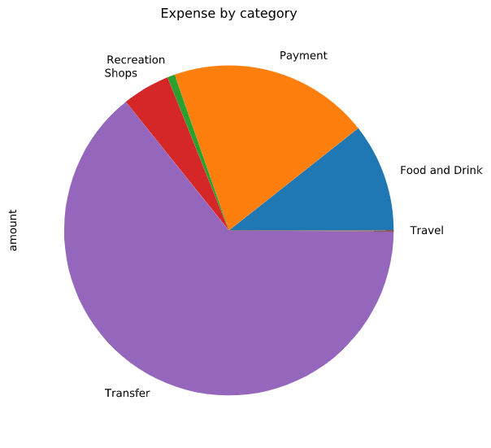
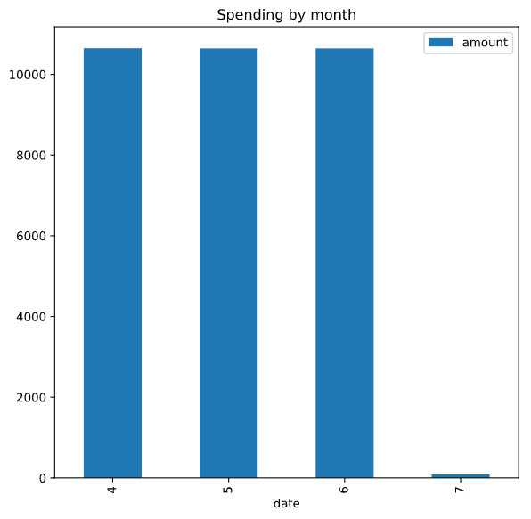
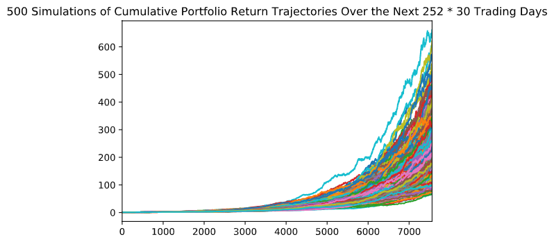

# Financial Report for Harold

## Budget Analysis

1. **Expense by Category**

    Transfer and payment accounted for most of the expense. Also, Harold spends minimal amount for travel. Pie chart is attached that classifies the expenses to the category. 

    Expense by Category:

    Category        | Name Amount
    ------------    | -------------|
    Food and Drink  | 3406.59
    Payment         | 6310.50
    Recreation      | 235.50
    Shops           | 1500.00
    Transfer        | 20537.34
    Travel          | 35.19

    Expense by Category - Pie chart:

    

2. **Expense by month**

    Please find the expense by month chart and tables 

    **Monthly Expense:**

    Month   |	Amount
    --------|----------|
    April   | 10649.46
    May     | 10645.24
    June    | 10645.24
    July    | 85.18

    **Monthly expense - Bar chart:**

    

## Retirement Analysis

1. **Monte Carlo simulatiom for 250*30 days**

    

    1. Recommendation based on 30 years inversting in AGG(40%) and SPY(60%)
    
        There is a chance that an initial investment of $20,000 in the portfolio over the next 252 * 30 trading days will end within the 10 percentile range of $2305601.150673056, 50 percentile range of $4176214.998429308 or 90 percentile range of $6890493.752890138

        In the above scenario - Retirement income 92224.04602692224 is more than the projected income 7389 at 10% confidence internal

    2. Recommendation based on 30 years inversting in AGG(40%) and SPY(60%) with **50% more intial investment**

        In the above scenario - Retirement income 138336.06904038336 is more than the projected income 7389 at 10% confidence internal

2. **Monte Carlo simulatiom for 250*5 days** 

    

    Assuming Harold wants to retire in 5 years instead of 30 years

    1. Option 1 - Increased Equity weight to 90% and Bond weight is reduced to 10%

        **Insufficient** - Retirement income for first option $ 1845.7981584919949 is less than the projected income $ 7389.00 at 10% confidence internal

    2. Option 2 - In this option - Initial investment is increased to $ 50,000 and Equity index weight is increased to 90%

        **Insufficient** - Retirement income for second option $ 4614.495396229988 is less than the projected income $ 7389.00 at 10% confidence internal

    3. Option 3 - In this option - Initial investment is increased to $ 85,000 and Equity index weight is increased to 90%

        **Sufficient** - Retirement income for third option $ 7844.642173590978 is more than the projected income $ 7389.00 at 10% confidence internal

    **Conclusion:** Harold needs to invest $ 85,000 and 90% exposure to SPY index to retire in 5 years.
